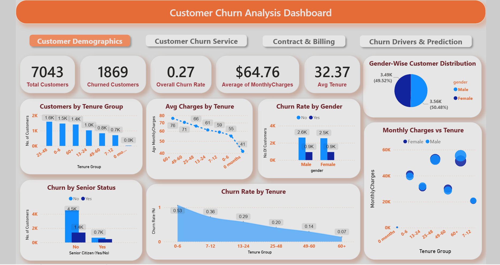
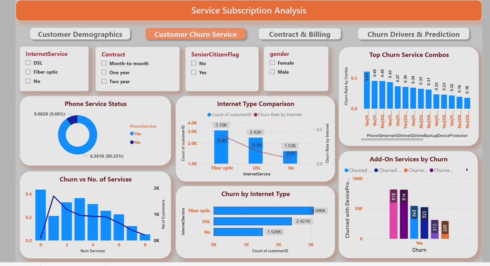
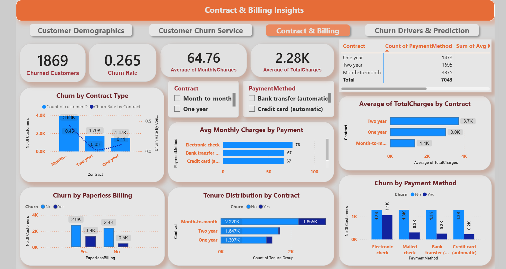
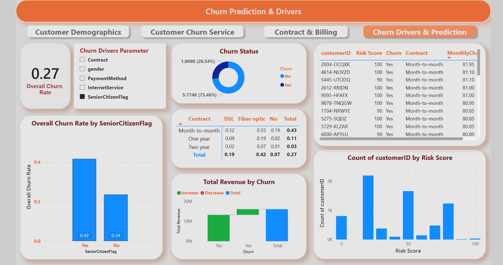

# PowerBI-Customer-Churn-Analysis
Customer Churn Analysis Dashboard built using Power BI. This report helps to understand why customers leave, identify key churn drivers, and find ways to retain valuable customers. Includes interactive visuals, KPIs, and data-driven insights.

# Customer Churn Analysis – Power BI Dashboard

### Dashboard Pages Preview
| Page | Preview |
|------|----------|
| **Page 1:** Overview |  |
| **Page 2:** Service Analysis |  |
| **Page 3:** Contract & Billing |  |
| **Page 4:** Churn Prediction |  |

---

### Overview
This project is an interactive Power BI dashboard that analyses customer churn for a telecom company.  
It helps to understand customer behavior, identify the main reasons for churn, and support data-based decisions to reduce churn and improve customer retention.

---
### Project Objectives
- Analyse overall churn rate and customer retention.
- Understand how gender, age, tenure, and services affect churn.
- Compare churn across different contracts, payment methods, and internet services.
- Identify high-risk customers who are likely to leave.
- Present clear visuals and KPIs for management insights.

---

### Tools and Skills Used
- **Power BI Desktop**
- **DAX (Data Analysis Expressions)**
- **Data Modelling**
- **Data Cleaning & Transformation**
- **Data Visualization**

---

### Dashboard Features
| Section | Description |
|----------|--------------|
| **Customer Demographics** | Shows total customers, gender distribution, and senior citizen churn. |
| **Customer Service** | Displays churn by phone, internet, and other service types. |
| **Contract & Billing** | Visualizes churn based on contract type, payment method, and monthly charges. |
| **Churn Drivers & Prediction** | Highlights key churn influencers and lists top 10 high-risk customers. |

---

### Files in this Repository
| File Name | Description |
|------------|--------------|
| `Customer_Churn_Analysis.pbix` | Main Power BI dashboard file |
| `Customer_Churn_Data.csv` | Dataset used for this project |
| `Customer_Churn_Report.pdf` | Exported PDF version of dashboard visuals |
| `README.md` | Project explanation and documentation |
| `DashboardPreview.png` | Screenshot preview of the dashboard (optional) |

---

### Live Dashboard
you can download the `.pbix` file from this repository and view it in **Power BI Desktop**.

---

### Key Insights
- Customers using **month-to-month contracts** have the highest churn rate.  
- **Fiber optic internet users** show more churn compared to DSL users.  
- **Electronic check payments** have higher churn than automatic payments.  
- Customers with **lower tenure (less than 12 months)** are more likely to leave.  

---

### How to View this Dashboard
1. Download the file `Customer_Churn_Analysis.pbix` from this repository.  
2. Open it using **Power BI Desktop** (free download).  
3. Explore all four dashboard pages using slicers and filters.

---

###  About the Author
**Arutla Rakshith**  
B.Tech in Computer Science (AI & Data Science)  
Aspiring Data Analyst | Skilled in Power BI, Python, SQL, and Data Visualization   
💼 [LinkedIn Profile](https://www.linkedin.com/in/rakshitharutla/)  
📂 [GitHub Profile](https://github.com/ArutlaRakshith)

---

### 🏁 Conclusion
This Power BI project helps in understanding customer churn behavior using data.  
It can be used by telecom or subscription-based companies to take business actions that improve retention and reduce churn rates.  
All visuals and insights are designed in a simple and meaningful way for easy understanding.

---

*Thank you for viewing this project. Your feedback and suggestions are always welcome!*
